# SimpleBlessed
这是一个简单的样例，使用 Swift + SwiftUI 展示如何通过Blessed库来实现SMJobless的提权方式，本案例中的方法融合了苹果官方与Blessed库提供的方法，希望能够以更简单清晰的方式说明Blessed的使用。


## 0. 前言

之前我希望能做一些命令行工具的GUI，从而更方便地调用系统的一些命令，比如这个项目：[静态路由助手](https://github.com/jdjingdian/StaticRouteHelper)，但是这个工具内的命令需要root权限才能够执行，一开始我是使用AppleScript的方式去获取root权限

``` bash
do shell script "your command" with administrator privileges
```

使用这种方式很简单，但是问题是每次执行命令的时候都需要弹出提示窗口输入密码，并且弹出的提示是AppleScript，与App本身割裂较大，使用起来没那么优雅。后来，我了解到苹果有一个SMJobBless的方法可以实现提权，只需要安装的时候弹出一次提示，后续helper程序都是以root权限运行，但是[苹果官方的SMJobBless教程](https://developer.apple.com/library/archive/samplecode/SMJobBless/Introduction/Intro.html)在2013年底更新后就没有更新过了。

好在有大佬提供了Swift封装的库，可以让我们更方便地使用SMJobBless ：[Blessed](https://github.com/trilemma-dev/Blessed) ，他们也提供了[Demo-SwiftAuthorizationSample](https://github.com/trilemma-dev/SwiftAuthorizationSample)，他们的Demo非常的详细，比较完整的说明了可以使用到的功能，但是对于初次接触SMJobBless的人来说，可能比较难上手，因此我创建了这个项目，希望能够尽可能简洁地展现SMJobBless的安装和使用，本项目主要关注项目的创建，对XPC通讯不做详细的展开。

> SMJobBless现在已经被苹果列为Deprecated API了，苹果在macOS 13.0推出了SMAppService API，看起来使用起来会更加简单，但是考虑到macOS 13现在仍然不太好用，我可能会保持在Monterey一段时间，因此还是先以SMJobBless的方式来提权。

### 工具与依赖

- [Python3魔改版的SMJobBlessUtil](https://gist.github.com/mikeyh/89a1e2ecc6849ff6056b7391c5216799) `Apple原版的只支持Python2且一直没更新`

- [Blessed](https://github.com/trilemma-dev/Blessed) `非常好用的SMJobless的Swift封装`
- [SecureXPC](https://github.com/trilemma-dev/SecureXPC) `XPC通讯库`


### 环境

**OS** : macOS 12.6.2

**XCode** : Version 14.2 (14C18) 

**Python** : /usr/bin/python3 `Python 3.9.6`

## 1. 项目配置

### 1. 首先，苹果要求，使用SMJobBlessed的方式注册Helper，需要关闭 **App Sandbox** 

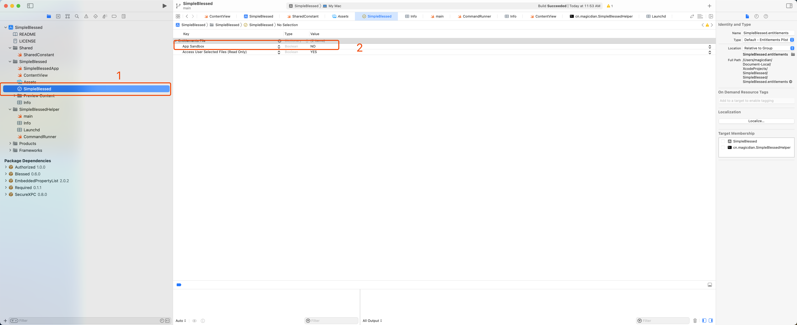

### 2. 创建Helper Target，选择Command Line Tools

   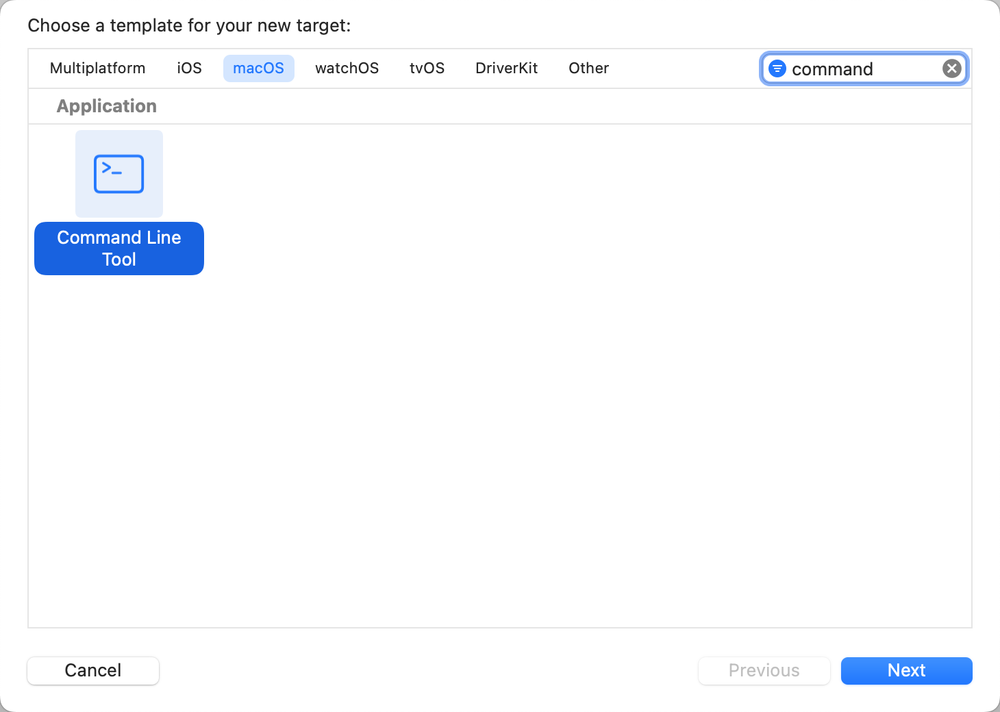

### 3. 主工程Target的Build Phases中添加Copy Files

   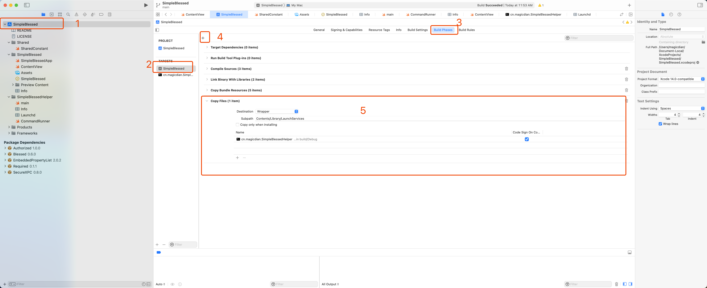

   - Destination选择 **Wrapper**
   - Subpath填写 `Contents/Library/LaunchServices`
   - 将Helper Target添加进来，并确保后面的 **Code Sign On Copy** 选项是勾选中的

### 4. 为主工程和Helper Target创建Info.plist

   > 这里需要注意的是，Xcode 13之后，主工程自动创建的Info.plist在项目中是不可见的，实际上是在工程设置的Info设置里，但是SMJobBless的流程需要Info.plist文件，所以我们也需要为主工程创建Info.plist

#### 1. 为主工程创建Info.plist

- 在主工程目录下新建一个文件，类型选择Property List

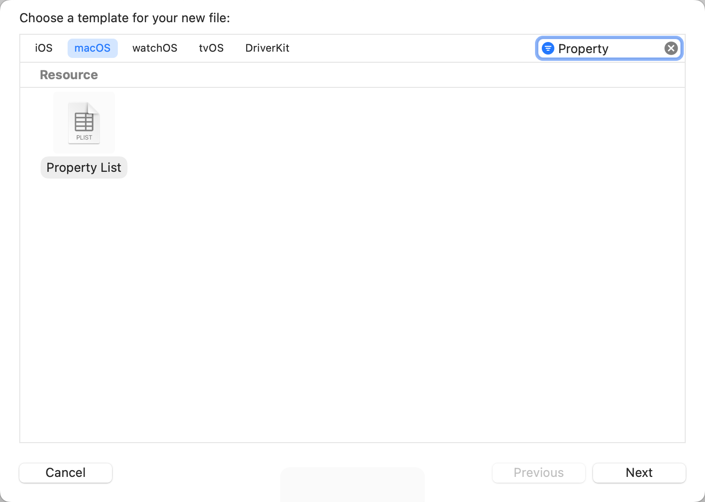

- 命名为**Info** 并添加到主工程Target

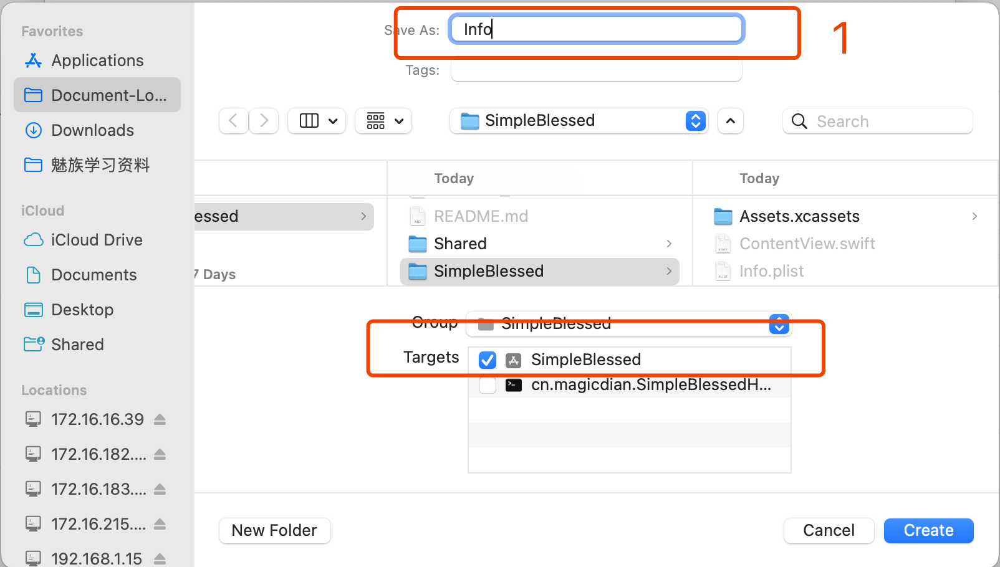

- 配置主工程的 **Build Settings** 设置

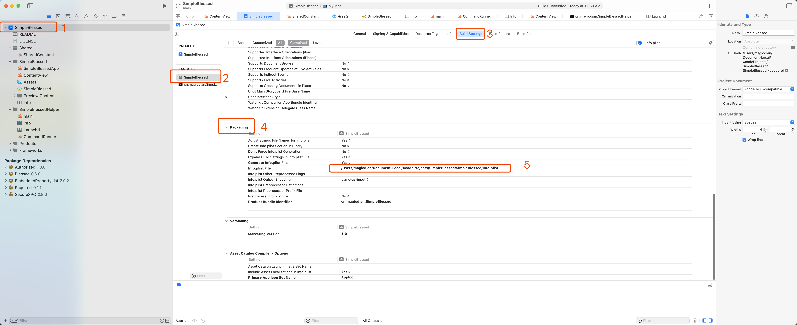

**Info.plist File** 中填入： `$(SRCROOT)/SimpleBlessed/Info.plist` 使用相对位置填入即可，XCode会自动解析

- 在主工程的Info选项中添加一项自定义的Key


添加完成后在Info.plist中就可以看到这条自定义的Key记录，这一个步骤的目的是为了防止之后修改项目Info的时候把手动创建的Info.plist覆盖

- **完全退出XCode再重新打开项目，这样可以确保Info.plist被正确加载**

#### 2. 为Helper Target创建Info.plist

这个步骤与第一步骤基本一致，在Helper Target中指定Info.plist的位置即可，但是需要注意，给Helper Target创建的Info.plist需要手动添加一些字段

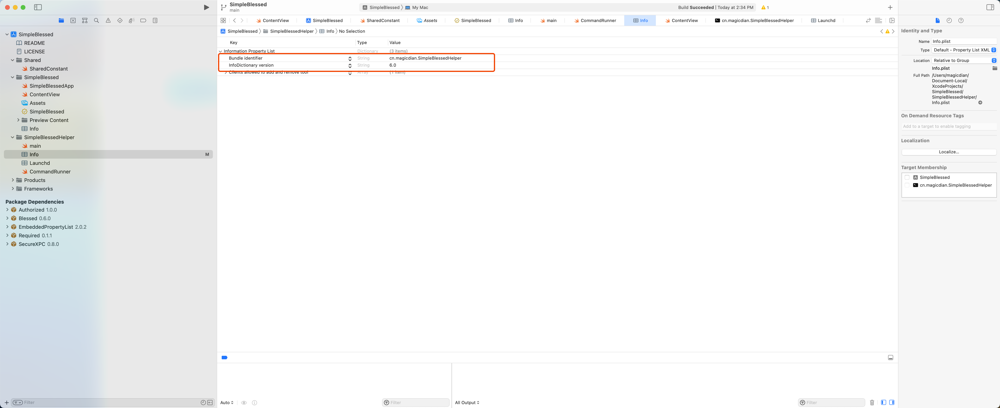

- Bundle identifier : Helper Target的名称，这里建议将Helper Target重命名为反向域名格式

  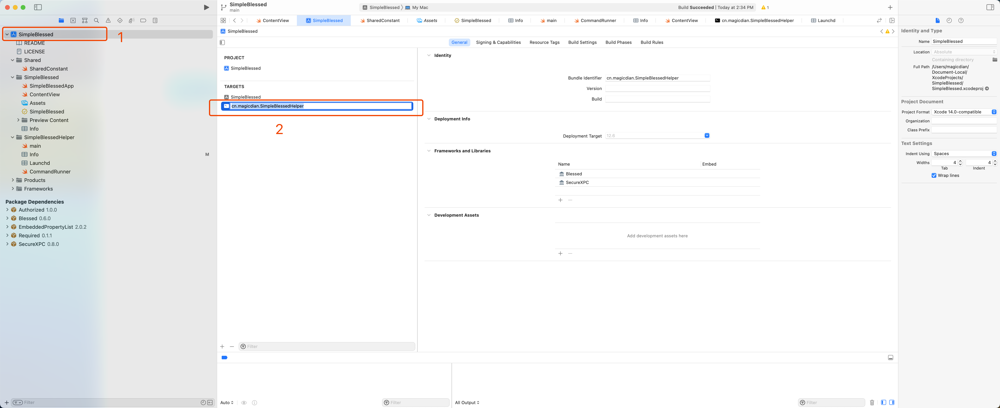

- InfoDictionary version : Info plist声明的版本，指定为6.0即可

### 5. 为Helper Target创建Launchd.plist

同样创建一个Property List，命名为Launchd.plist，你也可以设置成你喜欢的，后续的配置修改一下就行

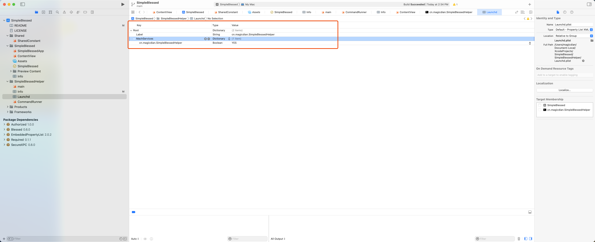

1. 创建一个类型为String的记录，key为Label，value填入你target的名称（上面已经把Target名称改成反向域名的写法了）
2. 创建一个字典记录，key为MachServices
3. 在MachServices字典记录内创建一个Boolean记录，key是你target的名称，value是**YES**

### 6. 配置Helper Target的Other Linker Flag

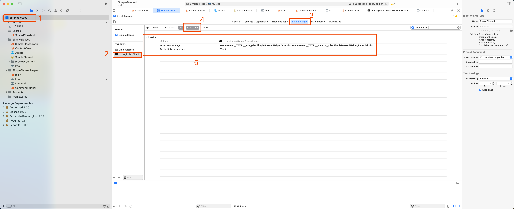

在Helper Target的Build Setting中，找到Linking，在里面的Other Linker Flags里配置

`-sectcreate __TEXT __info_plist SimpleBlessedHelper/Info.plist -sectcreate __TEXT __launchd_plist SimpleBlessedHelper/Launchd.plist`

这里把 **SimpleBlessedHelper/Info.plist** 和 **SimpleBlessedHelper/Launchd.plist** 替换成你们创建的Info.plist和Launchd.plist的位置就可以了

### 7. 使用Python脚本补全Info.plist

1. 下载修改版的SMJobBlessUtil [Python3魔改版的SMJobBlessUtil](https://gist.github.com/mikeyh/89a1e2ecc6849ff6056b7391c5216799) 

2. Build一次工程

3. 打开工程的输出目录，找到生成的app

4. 执行SMJobBlessUtil

   ``` bash
   ./SMJobBlessUtil.py setreq setreq ~/Library/Developer/Xcode/DerivedData/SimpleBlessed-fxubgmaoklpuijfroexydtikvqoj/Build/Products/Debug/SimpleBlessed.app /SimpleBlessed/SimpleBlessed/Info.plist /SimpleBlessed/SimpleBlessedHelper/Info.plist
   ```

​		上面的命令请自行修改app，app的Info.plist，Helper的Info.plist的位置

​		执行完后如果正常，会输出updated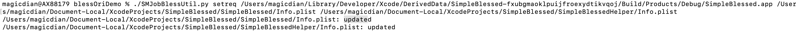

并且你在app的Info.plist会添加 **Tools owned after installation** 字典记录，Helper的Info.plist中会添加 **Clients allowed to add and remove tool** 字典记录

5. 再次Build一遍工程

6. 执行SMJobBlessUtil `./SMJobBlessUtil.py check /Users/magicdian/Library/Developer/Xcode/DerivedData/SimpleBlessed-fxubgmaoklpuijfroexydtikvqoj/Build/Products/Debug/SimpleBlessed.app `

   如果控制台没有输出，那么恭喜你，目前没有问题了，项目的基础配置完成了！

## 2. 导入Blessed和SecureXPC，初步使用！

> 这里就不多做展开解释了，代码量很少

1. 在项目工程的Package Dependencies里添加Blessed和SecureXPC

2. 主工程和Helper Target都嵌入Blessed和SecureXPC

3. 运行项目后点击Install Helper后会弹出提示，输入密码即可安装成功

   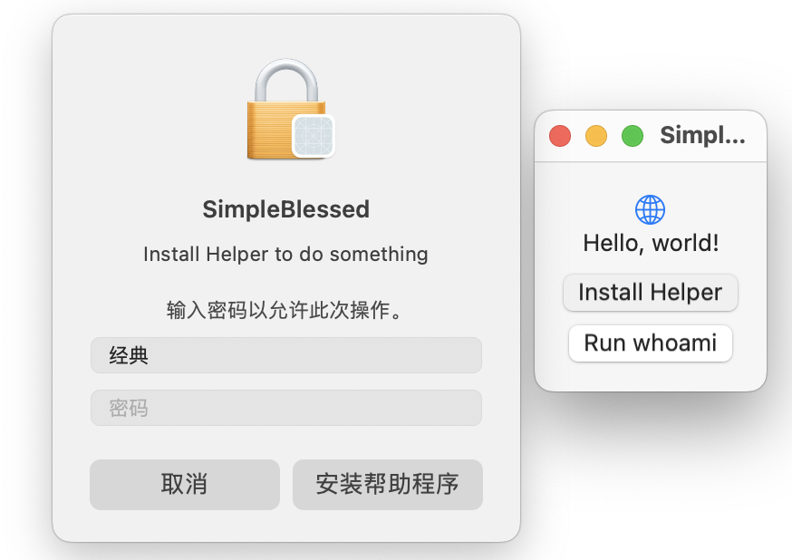

4. 打开系统的控制台应用开始流式传输，并过滤SimpleBlessedHelper的日志，然后点击**Run whoami**，可以看到日志中，helper运行whoami命令，识别到自身是root，说明现在helper已经有root权限了

   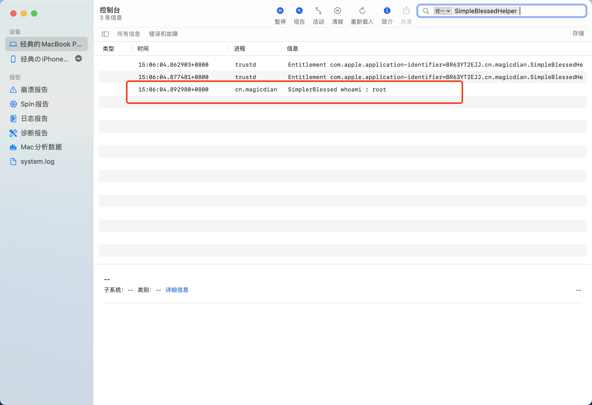
